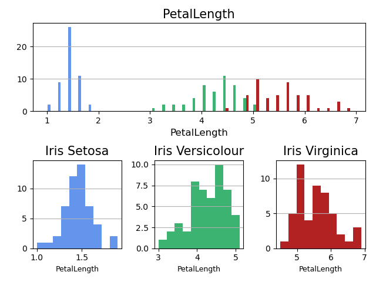
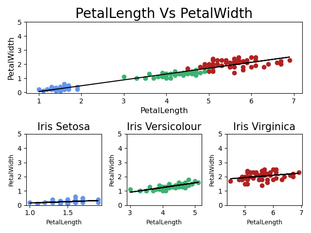

# Programming and Scripting - Project

This repository is my collection of work from the project as part of Programing and Scripting, Spring 2022.
The work in this repository is my own, and was completed as part of my programming and scripting module. 

## Description
In this data analysis we will be examining the relationship between the lenth and width dimentions of petals and septals for 150 Iris plant and for each of the 3 sub classes, 1. Iris Setosa, 2. Iris Versicolour, 3. Iris Virginica.

### Description of the Iris Database
The database was created by R.A. Fisher in 1936, analysis.py is used to analyis Fisher's Iris Database using python. This database details 150 Iris flowers, split evenly into 3 sub species of Iris flower, Iris Setosa, Iris Versicolour & Iris Virginica. The database details 4 attributes for each flower, sepal length (cm), sepal width (cm), petal length (cm) & petal width (cm).

Sepals and Petals are found on flowering plants. I would think an petal is easy for all to visualise, this is the flowering leaf of a plant, which may have adopted attracting colours to distinguish itself such as the red rose petals or the yellow sunflower petals. The Sepal again is a part uniquie to flowering plants, the role of the sepal is to protect the delicate flowering petals until:
  1. the plant is mature enought to flower.
  2. the enviornmental conditions are sufficent for the plant to flower.

Think of flowering plants with a bud ready to burst to life with petals, the protective shell you see is made of these sepals. When the time comes and the flower opens to reveal the petals, the sepals pull back to allow the petals to open fully.

The iris database comes with the following discription of the variable to confirm what attribute is in which column:

```
Attribute Information:
   1. sepal length in cm
   2. sepal width in cm
   3. petal length in cm
   4. petal width in cm
   5. class: 
      -- Iris Setosa
      -- Iris Versicolour
      -- Iris Virginica
```

From this we know, column 1. to 4. contains data in cm. From a later test it was confirmed that these values are entered as floating point numbers. Column 5. contains the class of each flower, this column uses data type string.

### Loading the Iris Database 
The data is now available online free for download from the references below. The data comes in a file called iris.data, for this data analysis we will be loading this file into python. The .data file type can be loaded as a CSV (comma-separated values) using the pandas module in python. So it is important to first tell python we will be using this modual, by importing it like this:

```
import pandas as pd
```

We can then use the read_csv function provided by the pandas modual, and save the database to a Python opject called irisData as so

```
irisData =  pd.read_csv('data\iris.data')
```

the database is now available for data analysis! when examing the database, it was noticed that the column names were not part of the database, from the very first line there was data entries. This can casue issues as python interperites this first line as being the column names for the data below. To fix this the column names can be manually assigned as the CSV file is being loaded. This can be done by adding another argument to the read_csv function called names, this is then followed by the list of column names to be used. The fuction for loading data then becomes:

```
irisData =  pd.read_csv('data\iris.data', names=['SepalLength', 'SepalWidth', 'PetalLength', 'PetalWidth', 'FlowerClass'])
```
It is important to note here, the column names are all defined as string values using the quotation marks.

As I regularly found myself wanting to analyse each of the 3 sub class of iris flower, I found it was easier to creat individual pyhton objects for the data pertaining to each sub class. This was done using a logical test on the flower class column, the example I show is for the irisSetosa flower:

```
irisData['FlowerClass'] == "Iris-setosa"
```

This logical test is applied to the whole irisData database and the result was saved to a object called irisSetosa as so:

```
irisSetosa = irisData[irisData['FlowerClass'] == "Iris-setosa"]
```

It is important here to confirm that the string entered into the logical test is exactly correct as a small typo here would result in no data being saved to the object.

Finally, it is important to complete these steps that the python terminal knows where to locate the iris.data file. To accomplish this first we must ensure the python terminal is in the correct folder location. Before running the analysis.py program I navigate to the folder where this program is stored. Secondly, when loading the iris file we must give the file path from the current folder to the iris.data file. In this case the file path is 

```
data\iris.data
```

## Investigation into database
the data analysis will take 2 approches on this database.
  1. An analysis of the Iris plant specties to find trends accross all Iris plant variations
  2. An analysis of each sub class of Iris plant, to find trends and identify areas where these plants differ. The 3 plant classes to be investigated are Iris Setosa, Iris Versicolor & Iris Virginica

### The first text analysis
Text analysis is a very usefull tool to very quickly get an understanding of the database we are working with. The first test used was the head() function, this is used to see the top 5 rows of a database. The result of this can be printed to the command line to see the result. This simple test was carried out on all 4 of the databases now created (irisData, irisSetosa, irisVersicolour & irisVirginica). The complete function is writen as so:

```
print(irisData.head())
```

Now having confirmed the database is working correctly I moved to a more detailed analysis of the IrisData, for this I used the .describe() function. This gives some usefull info such as Min, Max, Mean & Standard Devistion for each variable. The output of this is then saved to a text file so it can be reviewed at a later date. Running this code and having confirmed that the .txt file was created as expected, with the result of the .describe() function, we can see a summary for the whole iris database. This summary can be seen below.

Summary of Iris Data set.

```
        SepalLength   SepalWidth    PetalLength   PetalWidth
count---150.000000----150.000000----150.000000----150.000000

mean----5.843333------3.054000------3.758667------1.198667

std------0.828066------0.433594------1.764420------0.763161

min-----4.300000------2.000000------1.000000------0.100000

25%-----5.100000------2.800000------1.600000------0.300000

50%-----5.800000------3.000000------4.350000------1.300000

75%-----6.400000------3.300000------5.100000------1.800000

max-----7.900000------4.400000------6.900000------2.500000
```

I then set about adjusting the code used to become a function, so all 4 databases created could be passed through it in an efficent manner. The new function is called 4 times in the program, with each of the databases being passed through the describe() fuction and appended onto the text file. the result can be seen in Outputs\TextSummary\Analysis.txt

### Histogram Summaries
The same metodology as the text file is used here, first I wrote code that created the a histogram I wanted. Then I ajusted this code to become a function, so all 4 variable can be analyised using the same code.

The histograms were created using the matplotlib module. Initally I created a histogram of the whole irisData database, but it was quickly evident that more information needed to be included in the histogram to distinguish each of the flower classes. To overcome this, first I adjusted the histogram code to plot each of the flower classes to the same histogram, coloring each of these differently so it can be easily visualised.

I then decided to to use subplots to show each of the flower classes in isolation beneath the histogram. To accomplish this 
the upper subplot is given the input (2, 1, 1) to confirm there is 2 columns an 1 row which spans the full width, with this plot being on the upper row as the first plot. For the lower row the input was given as (2, 3, 4), meaning the histogram is sized to fit in 2 rows and 3 columbs, located in the 4th position which would make it the lower left. This was continued for the remaining two histograms on the lower row.



Confirming the histogram outputed as desired, I then saved this as a .jpeg using the matplotlib module. Having now wrote the code to output 1 histogram, I adjusted the code to become a function where each of the variables could be passed through the function to create a histogram that will be saved.

### Scatter plots
Having discovered the subplots were useful for the histograms, I decieded to keep the subplots for the scatter plots. Again I followed the followed the methodology of first creating a scatter plot of 2 vaiables. I then set about re-writing that code into a fuction which can be used to pass combinations of vairables through, making the code more efficent and easier to manage.

Coloring each flower class the same as the histogram to keep continuity. I also chose to add a trend line to each of the classes of flower and to the irisData set as a whole, to help easily identify trends or differences. The resulting scatter plots are saved to a new folder within the outputs folder.



### Additional analytsis
Finally


## Getting Started
### Executing program
the analysis.py program requires data from the iris.data database. This data base is availabe at: https://archive.ics.uci.edu/ml/datasets/iris. To use this database with the analysis.py program, the database should be saved in a folder titled "data", making the file path from the program "data\iris.data".

Secondly folders must be created for the outputs. A folder must be created titled "Outputs" and 3 sub folders will be created within the Outputs folder. These are 1. "TextSummary" 2. "Histograms" 3. "ScatterPlots". This makes the 3 file paths as "Outputs\TextSummary\" "Outputs\Histograms\" "Outputs\ScatterPlots\", when the program is run, these folders will be populated with the associated data.

## Help

Email: G00411281@gmit.ie

## Authors

Contributors names and contact info

ex. David Burke
ex. G00411281@gmit.ie

## Version History

* Initial Release

## License

Nil

## References
1. Fisher's Iris Database https://archive.ics.uci.edu/ml/datasets/iris
2. Research on what a Sepal is https://www.amnh.org/learn-teach/curriculum-collections/biodiversity-counts/plant-identification/plant-morphology/parts-of-a-flower#:~:text=Sepal%3A%20The%20outer%20parts%20of,that%20enclose%20a%20developing%20bud.
3. Describe function used in text analysis https://pandas.pydata.org/docs/reference/api/pandas.DataFrame.describe.html
4. Saving to a .txt file https://www.pythontutorial.net/python-basics/python-write-text-file/
5. Colours used for Histogram https://matplotlib.org/3.5.0/gallery/color/named_colors.html
6. Creating subplots https://matplotlib.org/stable/gallery/subplots_axes_and_figures/subplots_demo.html
7. How to get all pair combinations from a list https://www.geeksforgeeks.org/itertools-combinations-module-python-print-possible-combinations/
8. How to iterate through columns in a database https://stackoverflow.com/questions/28218698/how-to-iterate-over-columns-of-pandas-dataframe-to-run-regression
