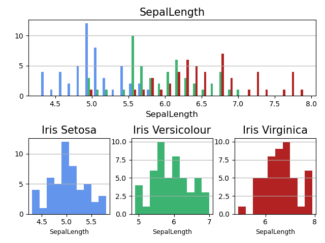
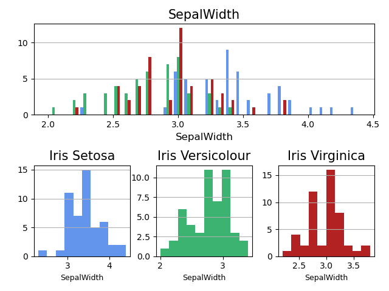

# Programming and Scripting - Project

This repository is my collection of work from the project as part of Programing and Scripting, Spring 2022.
The work in this repository is my own, and was completed as part of my programming and scripting module. 

## Description
In this data analysis we will be examining the relationship between the leanth and width dimentions of petals and septals for the Iris plant and for each of the 3 sub classes, 1. Iris Setosa, 2. Iris Versicolour, 3. Iris Virginica.

### Description of the Iris Database
The database was created by R.A. Fisher in 1936, analysis.py is used to analyis Fisher's Iris Database using python. This database details 150 Iris flowers, split evenly into 3 sub species of Iris flower, Iris Setosa, Iris Versicolour & Iris Virginica. The database details 4 attributes for each flower, sepal length (cm), sepal width (cm), petal length (cm) & petal width (cm).

Sepals and Petals are found on flowering plants. I would think an petal is easy for all to visualise, this is the flowering leaf of a plant, which may have adopted attracting colours to distinguish itself such as the red rose petals or the yellow sunflower petals. The Sepal again is a part uniquie to flowering plants, the role of the sepal is to protect the delicate flowering petals until:
  1. the plant is mature enought to flower.
  2. the enviornmental conditions are sufficent for the plant to flower.

Think of flowering plants with a bud ready to burst to life with petals, the protective shell you see is made of these sepals. When the time comes and the flower opens to reveal the petals, the sepals pull back to allow the petals to open fully.

### Loading the Iris Database 
The data is now available online free for download from the references below. The data comes in a file called iris.data, for this data analysis we will be loading this file into python. The .data file type can be loaded as a CSV (comma-separated values) using the pandas module in python. So it is important to first tell python we will be using this modual, by importing it like this "$import pandas as pd". We can then use the read_csv function provided by the pandas modual, and save the database to a Python opject called irisData as so "$irisData =  pd.read_csv('data\iris.data')

the database is now available for data analysis! when examing the database, it was noticed that the column names were not part of the database, from the very first line there was data entries. This can casue issues as python interperites this first line as being the column names for the data below. To fix this the column names can be manually assigned as the CSV file is being loaded. This can be done by adding another argument to the read_csv function called names, this is then followed by the list of column names to be used. The fuction for loading data then becomes "$irisData =  pd.read_csv('data\iris.data', names=['SepalLength', 'SepalWidth', 'PetalLength', 'PetalWidth', 'FlowerClass'])". it is important to note here, the column names are all defined as string values using the quotation marks.

As I regularly found myself wanting to analyse each of the 3 sub class of iris flower, I found it was easier to creat individual pyhton objects for the data pertaining to each sub class. This was done using a logical test on the flower class column, the example I show is for the irisSetosa flower $irisData['FlowerClass'] == "Iris-setosa". This logical test is applied to the whole irisData database and the result was saved to a object called irisSetosa as so: $irisSetosa = irisData[irisData['FlowerClass'] == "Iris-setosa"]. It is important here to confirm that the string entered into the logical test is exactly correct as a small typo here would result in no data being saved to the object.

### The first text analysis
text analysis is a very usefull tool to very quickly get an understanding of the database we are working with. The first test used was the head() function, this is used to see the top 5 rows of a database. The result of this can be printed to the command line to see the result. This simple test was carried out on all 4 of the databases now created (irisData, irisSetosa, irisVersicolour & irisVirginica). The complete function is writen as so: $print(irisData.head())

## Investigation into database
the data analysis will take 2 approches on this database.
  1. An analysis of the Iris plant specties to find trends accross all Iris plant variations
  2. An analysis of each sub class of Iris plant, to find trends and identify areas where these plants differ. The 3 plant classes to be investigated are Iris Setosa, Iris Versicolor & Iris Virginica

## Data Analysis
### Iris plant Text Summary
Summary of Iris Data set.

        SepalLength   SepalWidth    PetalLength   PetalWidth
count---150.000000----150.000000----150.000000----150.000000

mean----5.843333------3.054000------3.758667------1.198667

std------0.828066------0.433594------1.764420------0.763161

min-----4.300000------2.000000------1.000000------0.100000

25%-----5.100000------2.800000------1.600000------0.300000

50%-----5.800000------3.000000------4.350000------1.300000

75%-----6.400000------3.300000------5.100000------1.800000

max-----7.900000------4.400000------6.900000------2.500000

inital impresions reviewing this data shows:
  - The Sepal has a larger mean lenth than the Petal
  - The Sepal has a larger mean width than the Petal
  - The Petal Length has the largest standard deviation, showing it has the largest spread of datapoint.
  - The Sepal Width has the smallest standard deviation, showing it has the least  spread of datapoint.

This text analysis is useful, but the data can be more intuitively understood through graphing of the data for visualisation of the data.

### Iris plant Histrogram summary

From the above histogram we can visualise the large spread of data observed in the text summary, ranging between 1 and 7 cm. Observations from this Histogram.
  - Iris Setosa has the smallest mean Petal Lenght, and is far from the range for the Iris Versicolour & Iris Virginica. Iris Setosa also has has the smallest spread of data, or we could say it has the smallest standard deviation
  - Iris Virgincia has the largest mean value for Petal Length. Iris Virgincia also has the largest spread of data meaning it has the largest standard deviation. 
  - An inital hypothesis could be sugested here, that as the mean peatal lenght increases, the standard deviation for the spread of data increases in proportion to his.

Now looking at the Petal width.
  - The Iris Setosa again has the smallest Mean value for the petal width.
  - The Iris Virginica has the largest Mean value.
  - Again the trend can be seen that the smallest mean value has the smallest Standard Deviation.
  - following this, the largest mean value has the largest standard deviation.

## Getting Started

### Executing program
the analysis.py program requires data from the iris.data database. This data base is availabe at: https://archive.ics.uci.edu/ml/datasets/iris. To use this database with the analysis.py program, the database should be saved in a folder titled "data", making the file path from the program "data\iris.data".

Secondly folders must be created for the outputs. A folder must be created titled "Outputs" and 3 sub folders will be created within the Outputs folder. These are 1. "TextSummary" 2. "Histograms" 3. "ScatterPlots". This makes the 3 file paths as "Outputs\TextSummary\" "Outputs\Histograms\" "Outputs\ScatterPlots\", when the program is run, these folders will be populated with the associated data.

## Help

Email: G00411281@gmit.ie

## Authors

Contributors names and contact info

ex. David Burke
ex. G00411281@gmit.ie

## Version History

* Initial Release

## License

Nil

## References
1. Fisher's Iris Database https://archive.ics.uci.edu/ml/datasets/iris
2. Research on what a Sepal is https://www.amnh.org/learn-teach/curriculum-collections/biodiversity-counts/plant-identification/plant-morphology/parts-of-a-flower#:~:text=Sepal%3A%20The%20outer%20parts%20of,that%20enclose%20a%20developing%20bud.
